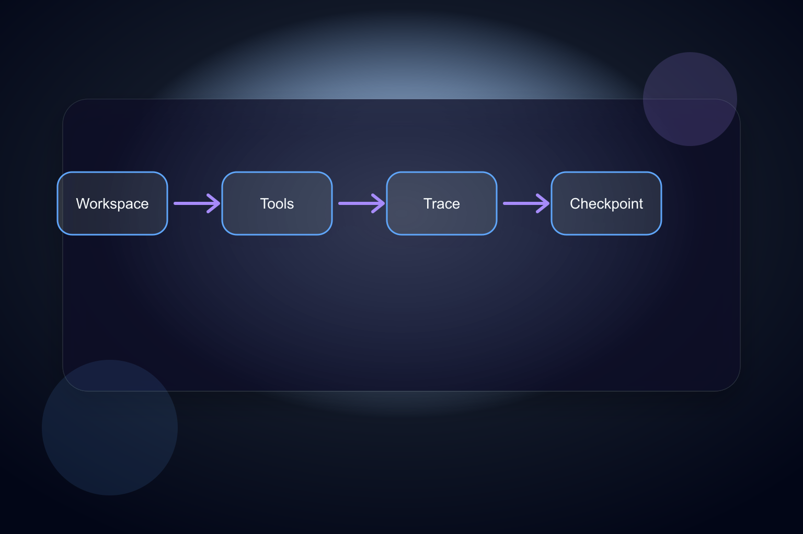
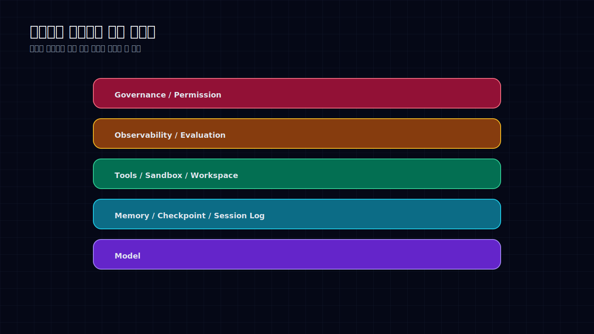
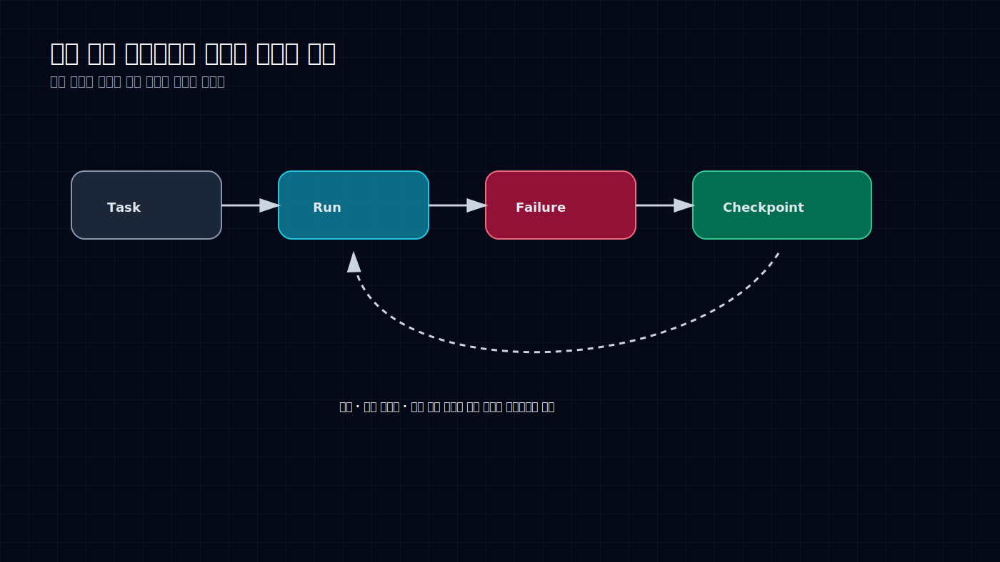

# AI 에이전트의 승부처는 모델이 아니라 작업장이다

좋은 모델을 고르면 에이전트 문제가 풀릴 것 같지만, 실제 업무에 넣어보면 제일 먼저 터지는 건 모델이 아니다.

상태가 사라진다. 파일 권한이 애매하다. 실패 로그가 없다. 중간 결과가 어디 갔는지 모른다. 도구 호출은 성공했다고 나오는데 실제 산출물은 쓸 수 없다. 사람이 어디서 승인해야 하는지도 불명확하다.

이때 필요한 건 더 똑똑한 챗봇이 아니다. **모델이 일할 작업장**이다.

2026년 봄에 반복해서 보인 흐름은 분명하다. OpenAI Agents SDK, LangChain runtime, Claude Code, Codex 같은 도구들은 모델 자체보다 모델 바깥을 두껍게 만들고 있다. memory, workspace, sandbox, permission, evaluation, trace, checkpoint. 이름은 다르지만 방향은 같다.

에이전트 제품은 모델 API 호출이 아니라 작은 운영체제에 가까워지고 있다.

## 채팅창은 실행 환경이 아니다

채팅창은 답변을 받기 좋다. 하지만 일을 오래 맡기기에는 약하다.

장기 실행 에이전트는 여러 단계를 거친다. 자료를 찾고, 파일을 만들고, 도구를 호출하고, 실패를 읽고, 사람에게 확인을 받고, 다시 이어서 실행한다. 이 과정에서 필요한 것은 말솜씨가 아니라 상태 관리다.

어떤 입력으로 시작했는가. 어떤 도구를 썼는가. 중간 산출물은 어디에 있는가. 실패했을 때 어디서 다시 시작할 수 있는가. 사람이 개입한 지점은 어디인가.

이 질문에 답하지 못하면 에이전트는 업무 도구가 아니라 긴 대화가 된다.

그래서 하네스 레이어가 중요하다. 하네스는 모델을 감싸는 실행 구조다. 도구 목록을 제한하고, workspace를 만들고, 권한을 나누고, 로그를 남기고, 실패를 분류하고, 사람이 승인할 수 있는 산출물로 회수한다.

좋은 모델은 그 안에서 더 잘 돈다. 나쁜 하네스 안에서는 좋은 모델도 위험한 자동완성이 된다.

## 실패를 남기지 않는 에이전트는 개선되지 않는다

에이전트 운영에서 제일 아까운 데이터는 실패다.

단발 채팅에서는 실패가 그냥 짜증으로 끝난다. 다시 물어보거나, 사람이 직접 고친다. 하지만 운영형 에이전트에서는 실패가 다음 실행을 개선하는 재료가 되어야 한다.

어떤 tool call이 틀렸는지, 어떤 permission에서 막혔는지, 어떤 파일을 잘못 읽었는지, 어떤 평가 기준을 통과하지 못했는지 남아야 한다. 그래야 다음번에 같은 실수를 줄인다.

여기서 session log와 checkpoint가 나온다. 에이전트가 멈춰도 작업은 사라지면 안 된다. 중간 산출물, 실패 원인, 재시작 지점이 남아야 한다.

이건 단순 개발 편의가 아니다. 기업 도입에서는 감사와 책임의 문제다. 누가 무엇을 승인했는가. 어떤 데이터가 외부로 나갔는가. 어떤 판단을 모델이 했고 어떤 판단을 사람이 했는가. 기록이 없으면 설명할 수 없다.

## 실무 조직가 먼저 표준화해야 할 것

실무 조직에서 에이전트를 제품과 업무에 넣는다면, 모델 선택보다 먼저 정해야 할 것이 있다.

첫째, 실행 계약이다. 입력 schema, 출력 schema, 실패 시 반환 형식, tool call 제한, human confirmation 조건을 고정해야 한다. “알아서 해줘”는 실험에는 좋지만 운영에는 약하다.

둘째, 작업 상태 저장이다. session log, 중간 산출물, 근거 링크, checkpoint가 남아야 한다. 사람이 나중에 이어받을 수 있어야 하고, 다른 에이전트가 다시 읽을 수 있어야 한다.

셋째, 평가 루프다. 정확도만 보면 안 된다. 비용, 속도, tool call 효율, 실패 복구율, 사람 개입 횟수, trace 품질을 같이 봐야 한다.

넷째, 안전장치다. 권한 분리, sandbox, 외부 전송 전 승인, 민감 데이터 필터링은 기능 출시 뒤에 붙이면 늦다. 하네스 안에 처음부터 들어가야 한다.

나는 이 순서가 현실적이라고 본다. 모델은 계속 바뀐다. 오늘의 최고 모델이 다음 달에는 평범해진다. 하지만 실행 계약과 로그 구조는 오래 남는다.

에이전트 운영의 핵심은 “어떤 모델이 제일 똑똑한가”가 아니다. **똑똑한 모델이 실수해도 조직이 망가지지 않는 작업장을 만들었는가**다.

## Sources

- OpenAI Agents SDK, LangChain runtime, Claude Code, Codex 등 에이전트 실행 환경 관련 공개 자료
- workspace agent, background subagent, memory, session log, observability 관련 제품/기술 동향
- 이 글은 공개 자료와 필자의 리서치 메모를 바탕으로 재구성했다.
