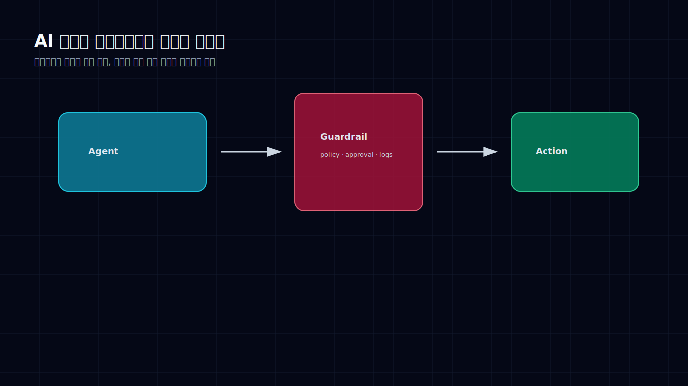
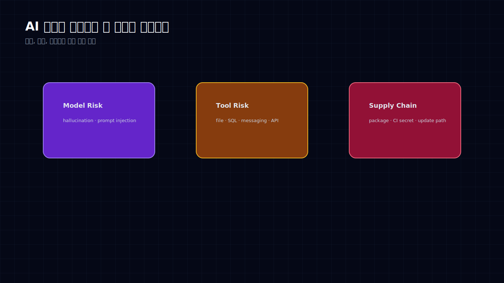
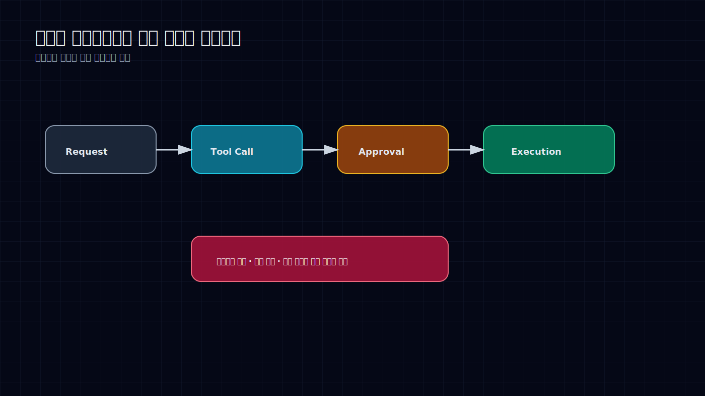

# AI 에이전트 보안은 체크리스트가 아니라 실행 회로다

AI가 답변만 할 때 보안은 비교적 단순했다. 이상한 답을 하면 사람이 무시하면 됐다.

에이전트가 도구를 쓰기 시작하면 이야기가 달라진다. 파일을 읽고, SQL을 실행하고, 메시지를 보내고, 외부 API를 호출한다. 이제 틀린 답변은 문장으로 끝나지 않는다. 실제 행동이 된다.

그래서 AI 보안을 “출시 전 체크리스트”로 보면 늦다. 안전은 에이전트가 움직이는 회로 안에 들어가야 한다. 권한, 승인, 로그, 민감정보 필터, 평가 데이터가 실행 경로에 붙어 있어야 한다.

## 공격면은 모델 하나가 아니다

AI 보안 리스크를 모델 환각으로만 보면 반쪽이다.

첫 번째는 모델 리스크다. prompt injection, hallucination, 과도한 확신, 근거 없는 판단이 여기에 들어간다.

두 번째는 도구 리스크다. 에이전트가 파일, SQL, 메시징, 결제, 배포 도구를 잡는 순간 권한 문제가 생긴다. 모델이 틀리면 도구가 틀린 행동을 한다.

세 번째는 공급망 리스크다. LiteLLM PyPI 공격 같은 사례는 AI 개발 도구 자체가 공격 경로가 될 수 있음을 보여준다. dependency pinning, lock file, CI/CD secret, package provenance는 AI 프로젝트에서도 평범하게 중요해졌다.

이 세 가지를 분리해서 봐야 한다. 모델만 안전하게 만들어도 도구 권한이 열려 있으면 위험하다. 도구 권한을 막아도 공급망이 뚫리면 소용없다.

## 기업형 에이전트에는 승인 기록이 필요하다

기업에서 중요한 건 “AI가 좋은 결과를 냈다”가 아니다. **그 결과가 어떤 과정을 거쳐 나왔는지 설명할 수 있는가**다.

외부 채널로 메시지를 보내기 전 사람이 승인했는가. 민감 데이터가 prompt나 log, vector store에 남지 않았는가. SQL과 파일 권한은 분리되어 있는가. tool call trace가 저장되는가. 실패와 거절 사례가 평가 데이터로 쌓이는가.

이 질문들은 귀찮은 문서 작업처럼 보이지만, 실제로는 제품을 계속 쓰게 해주는 조건이다. 로그가 없으면 감사할 수 없고, 권한이 없으면 통제할 수 없고, 평가 데이터가 없으면 개선할 수 없다.

EU AI Act 같은 규제 대응도 결국 여기로 온다. 정책 문서만으로는 부족하다. 실행 로그와 human-in-the-loop 기록이 있어야 한다.

## 실무 조직에서 먼저 막아야 할 구멍

실무 조직에서 agent를 Flow, 분석 파이프라인, 문서 처리, 고객-facing 업무에 붙인다면 최소 기준은 이렇다.

외부 전송은 기본적으로 승인 후 실행한다. Slack, Discord, 이메일, 고객 채널은 모두 action boundary다.

민감 데이터는 prompt, log, vector store에 남기 전에 필터링한다. 특히 고객 데이터와 내부 업무 데이터의 경계를 문서화해야 한다.

SQL, 파일, 메시징 tool 권한은 분리한다. “읽기만 가능”, “초안 작성 가능”, “실제 전송 가능”은 전혀 다른 권한이다.

실패와 거절 사례를 버리지 않는다. 이 데이터가 다음 eval set이 된다.

AI 보안은 “막는 일”만은 아니다. 제대로 설계하면 에이전트를 더 과감하게 쓸 수 있게 해준다. 어디까지 자동으로 보내도 되는지, 어디서 사람을 세워야 하는지 명확해지기 때문이다.

에이전트가 일을 하게 만들수록 안전은 더 제품 안쪽으로 들어와야 한다. 밖에서 검사하는 보안으로는 늦다. 실행 회로 안에 들어간 보안만 작동한다.

## Sources

- Project Glasswing, AI cyber model, EU AI Act, LangChain evaluation/logging, OpenAI privacy filter 관련 공개 자료
- LiteLLM PyPI 공급망 공격 등 AI 개발 도구 생태계의 보안 사례
- 이 글은 공개 자료와 필자의 리서치 메모를 바탕으로 재구성했다.
