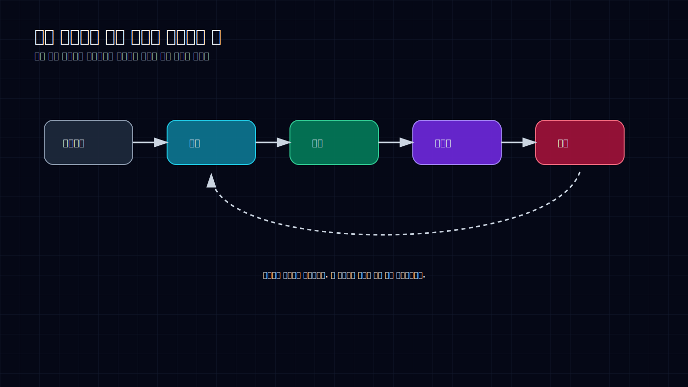
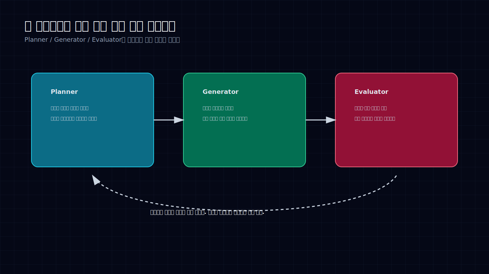
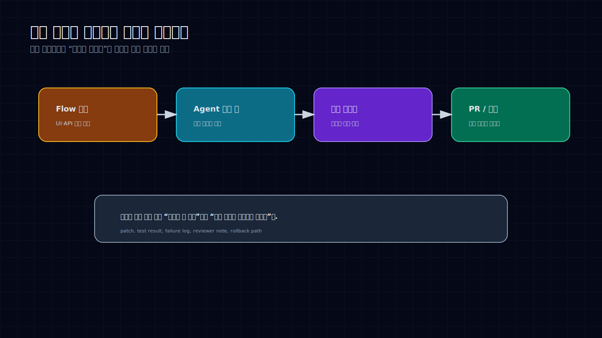

# 코딩 에이전트는 IDE 기능이 아니라 작업 방식이다


처음에는 다들 Copilot처럼 생각했다. 옆에서 코드를 한 줄씩 추천해주는 도구. 맞으면 Tab을 누르고, 틀리면 지우는 정도.

그런데 지금 코딩 에이전트를 그렇게 보면 거의 놓친다. 변화는 “코드를 누가 치느냐”가 아니다. **일을 어떤 단위로 맡기느냐**가 바뀌고 있다.

예전에는 개발자가 구현을 머릿속에서 쪼개고, 파일을 열고, 코드를 고치고, 테스트를 돌리고, 실패를 읽고, 다시 고쳤다. 에이전트가 들어오면 이 루프 일부를 통째로 넘길 수 있다. 요구사항을 주면 계획을 세우고, 패치를 만들고, 테스트를 돌리고, 실패하면 다시 고친다.

이 순간부터 코딩 에이전트는 IDE 플러그인이 아니다. 작은 개발 프로세스다.

## 자동완성은 줄을 제안하고, 에이전트는 루프를 돈다



자동완성은 손의 속도를 올린다. 에이전트는 작업의 경계를 바꾼다.

이 차이가 중요하다. 자동완성은 여전히 사람이 모든 상태를 들고 있어야 한다. 어떤 파일을 열지, 어떤 테스트를 돌릴지, 실패 로그를 어떻게 해석할지, 이 변경이 PR로 남을 만한지 전부 사람이 판단한다.

에이전트 워크플로에서는 질문이 달라진다.

> “이 코드를 어떻게 쓰지?”가 아니라 “이 일을 어떤 검증 루프 안에 넣지?”가 된다.

그래서 좋은 코딩 에이전트 환경은 채팅창 하나로 끝나지 않는다. 작업 큐가 있고, repo context가 있고, 테스트 명령이 있고, 실패 로그가 보존되고, 사람이 승인할 수 있는 patch나 PR이 남는다. 여기까지 가야 “일을 맡겼다”고 말할 수 있다.

그냥 모델에게 “이거 고쳐줘”라고 던지고 결과를 복붙하는 건 바이브에 가깝다. 작동하면 빠르지만, 실패했을 때 어디서 틀어졌는지 남지 않는다.

## 한 명의 천재 에이전트보다 세 개의 역할이 낫다



최근 에이전트 하네스 이야기를 보면 반복해서 나오는 구조가 있다. Planner, Generator, Evaluator의 분리다.

Planner는 일을 자른다. 요구사항을 작은 단위로 만들고, 순서를 정하고, 애매한 부분을 질문으로 바꾼다.

Generator는 실제 변경을 만든다. 파일을 고치고, 테스트를 추가하고, patch를 남긴다.

Evaluator는 결과를 믿지 않는다. 테스트를 돌리고, 실패 로그를 읽고, 회귀를 의심하고, 사람이 리뷰할 수 있게 증거를 요구한다.

이 구조가 좋은 이유는 단순하다. 실패 지점이 보인다.

하나의 에이전트에게 “기능 만들어줘”라고 시키면 결과가 그럴듯해도 찜찜하다. 계획이 틀렸는지, 구현이 틀렸는지, 테스트가 약한지 분간하기 어렵다. 반대로 역할을 나누면 사람이 끼어들 지점이 생긴다. 계획만 리뷰할 수도 있고, 구현은 맡기되 테스트 기준은 고정할 수도 있다.

이건 개발팀의 구조와 닮았다. 좋은 팀에서 기획, 구현, 리뷰가 섞이긴 해도 완전히 뭉개지지는 않는다. 에이전트도 마찬가지다. 똑똑한 하나를 믿는 것보다, 서로 다른 실패 모드를 가진 셋을 묶는 편이 안전하다.

## 작은 에이전트가 오히려 강한 이유

mini-swe-agent, Clarc, diffnav 같은 흐름이 흥미로운 건 규모 때문이 아니다. 오히려 작아서 흥미롭다.

작은 에이전트는 자기 일이 선명하다. repo 전체를 “이해”한다고 말하지 않는다. 특정 실패를 재현하거나, diff를 읽거나, 작은 patch를 만들거나, CLI 안에서 제한된 루프를 돈다.

이런 도구는 멋은 덜하다. 데모 영상에서 사람을 놀라게 하기도 어렵다. 대신 운영하기 쉽다. 실패하면 왜 실패했는지 보인다. 코드를 읽을 수 있고, 룰을 바꿀 수 있고, 필요하면 갈아엎을 수 있다.

대형 플랫폼형 에이전트는 넓은 일을 맡길 수 있지만, 그만큼 실패도 넓게 난다. 작은 에이전트는 좁은 일을 반복해서 잘한다. 실제 업무에서는 이쪽이 더 빨리 쌓인다.

내부 개발 자동화도 비슷하다. “우리 회사 전용 만능 개발자 에이전트”보다 “SQL 예제 검증 에이전트”, “문서 코드블록 실행 에이전트”, “PR 영향 범위 요약 에이전트”가 먼저 돈다. 작고 지루한 것부터 자동화해야 한다. 거기서 신뢰가 생긴다.

## 실무 조직에 필요한 것은 코딩 에이전트가 아니라 검증 가능한 작업 레일이다



실무 조직 관점에서 보면 질문은 “어떤 모델을 쓸까?”가 아니다. 그건 계속 바뀐다.

더 오래 남는 질문은 이거다.

> 에이전트가 만든 변경을 어떤 형태로 검증하고, 어떤 단위로 사람이 승인할 것인가?

Flow 개발, SQL/분석 파이프라인, 내부 API 예제, 문서 코드블록, PR 리뷰는 전부 후보가 된다. 다만 바로 “전체 개발 자동화”로 가면 위험하다. 먼저 산출물의 모양을 고정해야 한다.

좋은 단위는 이런 식이다.

```text
입력: 작은 요구사항 하나
출력: patch + 테스트 결과 + 실패 로그 + 리뷰 요약 + 롤백 가능성
```

이렇게 남으면 사람이 판단할 수 있다. 반대로 “제가 고쳤습니다”라는 답변만 남으면 아무것도 맡긴 게 아니다. 다시 사람이 열어보고, 다시 추론하고, 다시 검증해야 한다. 그건 자동화가 아니라 일감 이동이다.

코딩 에이전트의 생산성은 모델의 똑똑함에서만 나오지 않는다. 작업을 맡기고 회수하는 포맷에서 나온다. 포맷이 없으면 모델이 좋아져도 팀은 불안해서 못 쓴다.

## 지금 바꿔야 할 운영 규칙

앞으로 코딩 에이전트를 쓸 때 기준을 이렇게 잡는 게 낫다.

첫째, “코드를 만들어줘”보다 “이 테스트를 통과하는 patch를 만들어줘”라고 시킨다. 검증 기준이 없는 요청은 데모에는 좋지만 운영에는 약하다.

둘째, 큰 일을 바로 맡기지 않는다. Planner가 먼저 작업을 쪼개고, 사람이 그 계획을 승인한 뒤 Generator가 움직이는 편이 낫다.

셋째, 모든 결과는 patch나 PR 단위로 남긴다. 채팅 답변은 휘발된다. diff는 검토된다.

넷째, 실패 로그를 버리지 않는다. 실패 로그가 쌓여야 다음 에이전트가 더 잘한다. 실패는 노이즈가 아니라 운영 데이터다.

다섯째, 작은 에이전트를 먼저 만든다. 문서 예제 검증, SQL 테스트, API 샘플 생성, PR 요약처럼 반복적이고 검증 가능한 것부터 시작한다.

나는 이게 “AI가 개발자를 대체한다”는 이야기보다 훨씬 현실적이라고 본다. 개발자는 사라지지 않는다. 대신 개발자가 들고 있던 루프 일부가 밖으로 빠진다. 그리고 그 루프를 설계하는 사람이 더 중요해진다.

코딩 에이전트 시대의 실력은 프롬프트를 예쁘게 쓰는 능력이 아니다. 일을 맡길 수 있는 형태로 자르고, 검증 장치를 붙이고, 결과를 회수하는 능력이다.

자동완성은 코드를 빠르게 치게 했다. 에이전트는 일을 다르게 맡기게 만든다. 차이는 거기서 난다.

## Sources

- Anthropic, OpenAI Codex, Claude Code 등 코딩 에이전트와 agent harness 흐름에 대한 공개 발표와 제품 업데이트
- mini-swe-agent, Clarc, diffnav 등 작은 코딩 에이전트/개발 보조 도구 사례
- 이 글은 공개 자료와 필자의 리서치 메모를 바탕으로 재구성했다.
