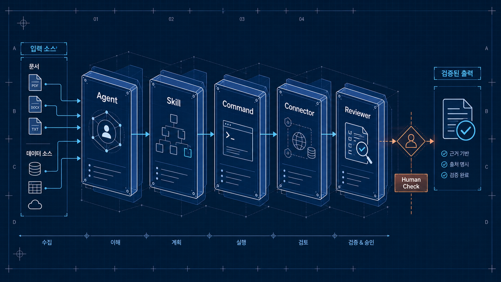
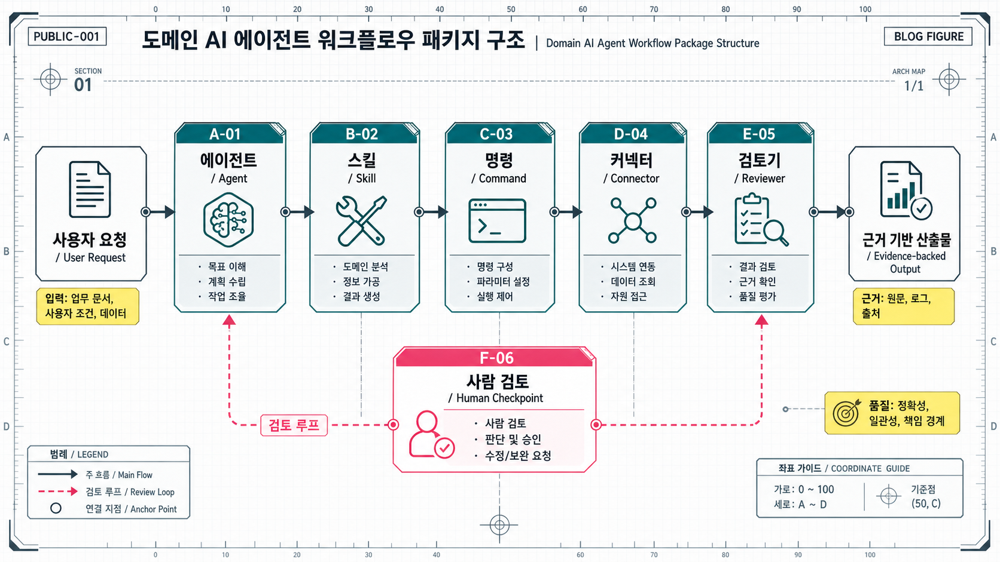

# AI 에이전트는 프롬프트가 아니라 업무 패키지다



좋은 프롬프트 하나로 도메인 AI 에이전트를 만들 수 있을 것 같지만, 실제 업무에 넣어보면 금방 한계가 온다.

금융 분석을 한다면 시장 데이터가 필요하다. 부동산 상담을 한다면 매물, 실거래, 등기, 규제, 대출 조건이 필요하다. 법률·세무·투자처럼 위험한 영역에서는 어떤 말을 해도 되는지, 어디서 사람 승인을 받아야 하는지도 정해야 한다.

이때 필요한 것은 “너는 최고의 전문가야” 같은 시스템 프롬프트가 아니다. **업무를 반복 가능한 단위로 포장한 구조**다.

내가 도메인 AI 에이전트를 볼 때 점점 더 중요하게 보는 것도 이 지점이다. 에이전트는 똑똑한 말상대가 아니라, 특정 업무를 끝까지 수행하기 위한 작은 업무 패키지에 가까워지고 있다.

## 한 문장으로 답하면

도메인 AI 에이전트는 다음 다섯 가지를 함께 묶어야 한다.

> Agent는 업무 주체를 정의하고, Skill은 절차를 담고, Command는 반복 작업을 호출하고, Connector는 데이터를 가져오고, Reviewer는 위험한 출력을 막는다.

이 다섯 가지가 없으면 에이전트는 데모에서는 그럴듯하지만, 실제 조직에서는 곧 “긴 챗봇”이 된다.

## 왜 프롬프트만으로는 부족한가

프롬프트는 역할을 줄 수 있다. 하지만 업무 시스템은 역할만으로 굴러가지 않는다.

예를 들어 “금융 애널리스트처럼 기업을 분석해줘”라고 하면 모델은 보고서 비슷한 글을 만들 수 있다. 하지만 실제 업무에서는 더 구체적인 문제가 생긴다.

- 어떤 데이터 소스를 우선할 것인가?
- 수치가 서로 다르면 무엇을 기준으로 할 것인가?
- 엑셀 모델, 프레젠테이션, 메모 중 어떤 산출물을 만들 것인가?
- 투자 권유처럼 말하면 안 되는 문장은 어떻게 막을 것인가?
- 최종 배포 전에 누가 승인해야 하는가?

부동산 상담도 마찬가지다.

“이 집 사도 될까요?”라는 질문에 모델이 바로 “좋습니다” 또는 “위험합니다”라고 답하면 안 된다. 가격, 입지, 권리관계, 대출 가능성, 세금, 규제, 생활환경이 서로 얽혀 있고, 어떤 항목은 반드시 전문가 확인이 필요하다.

그래서 도메인 에이전트는 답변 생성기가 아니라 **업무 흐름 관리자**로 설계해야 한다.

## 공개된 금융 에이전트 사례에서 보이는 구조

Anthropic이 공개한 금융 서비스 에이전트 예시는 이 흐름을 잘 보여준다. 흥미로운 점은 이 자료가 단순한 프롬프트 모음이 아니라는 것이다. 구조는 대략 다음과 같이 나뉜다.

| 구성 | 역할 | 왜 중요한가 |
|---|---|---|
| Agent | 특정 업무를 맡는 주체 | 시장 조사, 피치 작성, KYC 검토처럼 책임 범위를 정한다 |
| Skill | 도메인 절차와 판단 기준 | 비교 분석, 리스크 검토, 문서 작성 규칙을 재사용한다 |
| Command | 반복 업무 호출 단위 | `/comps`, `/brief`, `/review`처럼 자주 쓰는 작업을 표준화한다 |
| Connector | 외부·내부 데이터 연결 | 시장 데이터, 문서 저장소, CRM, 업무 시스템과 연결한다 |
| Managed Agent | API/headless 실행 단위 | 채팅창 밖에서 반복 실행하고 배포할 수 있게 한다 |
| Reviewer / Guardrail | 위험 출력 검토 | 투자 조언, 확정 판단, 근거 없는 수치를 막는다 |

여기서 핵심은 “모델에게 더 잘 말하는 법”이 아니다. **업무를 어떤 단위로 나누고, 어떤 데이터에 연결하고, 어떤 출력을 금지할지 정하는 법**이다.

이런 구조는 금융에만 해당하지 않는다. 의료, 법률, 세무, 부동산, 공공행정, 도시 데이터 분석처럼 근거와 책임이 중요한 도메인에서는 거의 같은 문제가 반복된다.



## 도메인 에이전트의 최소 설계 단위

내 기준에서 도메인 AI 에이전트를 설계할 때 최소 단위는 아래와 같다.

### 1. Agent: 무엇을 끝까지 책임지는가

Agent는 성격이 아니라 업무 책임이다.

나쁜 정의는 이렇다.

> “너는 친절하고 유능한 부동산 전문가야.”

좋은 정의는 이렇게 바뀐다.

> “사용자의 주거 조건과 매물 정보를 정리하고, 가격·입지·계약 리스크를 근거 기반으로 비교한 뒤, 전문가 확인이 필요한 항목을 분리해 상담 메모를 작성한다.”

역할보다 산출물이 먼저다. 무엇을 만들고, 어디까지 말할 수 있고, 무엇은 사람에게 넘길지가 Agent 정의에 들어가야 한다.

### 2. Skill: 도메인 절차를 재사용 가능하게 만든다

Skill은 “잘 대답하는 요령”이 아니라 업무 절차다.

예를 들어 전월세 리스크를 보는 Skill이라면 다음이 들어가야 한다.

- 상담 단계: 탐색, 계약 전, 계약 직전, 계약 후
- 필요한 입력: 주소, 보증금, 월세, 시세, 등기, 건축물대장, 중개 설명 자료
- 체크 항목: 소유자, 근저당, 선순위 권리, 보증보험 가능성, 위반건축물 여부
- 출력 방식: 낮음/중간/높음/추가 확인 필요
- 금지 사항: 계약 체결 권유, 법률 판단 확정, 보증보험 가능성 단정

이런 절차가 Skill로 분리되어 있어야 다른 Agent나 Command에서도 재사용할 수 있다.

### 3. Command: 반복 업무를 호출 가능한 단위로 만든다

사람은 매번 긴 프롬프트를 쓰고 싶어 하지 않는다. 반복되는 업무는 명령어가 되어야 한다.

예를 들면 다음과 같다.

| Command | 목적 |
|---|---|
| `/property-brief` | 특정 매물의 가격·입지·리스크 요약 |
| `/price-comps` | 주변 실거래와 비교 매물 분석 |
| `/lease-risk` | 전월세 계약 리스크 체크 |
| `/neighborhood` | 교통·생활권·상권·환경 분석 |
| `/affordability` | 예산과 대출 상환 부담 점검 |

Command는 단축키가 아니다. 입력, 절차, 산출물, 품질 기준을 고정하는 장치다.

### 4. Connector: 답변이 아니라 근거를 가져온다

도메인 AI의 품질은 모델이 얼마나 그럴듯하게 말하느냐보다, 어떤 데이터에 연결되어 있느냐에 크게 좌우된다.

금융에서는 시장 데이터, 기업 공시, 리서치 문서, CRM이 중요하다. 부동산에서는 실거래, 매물, 지도, 등기, 건축물대장, 토지이용계획, 대출 조건, 정책 정보가 중요하다.

Connector가 없으면 에이전트는 일반론만 말한다. Connector가 있으면 “현재 입력에 대해 확인 가능한 근거”를 가져올 수 있다.

다만 여기서도 중요한 원칙이 있다. 데이터 연결은 자동 판단 권한과 다르다. 데이터를 가져올 수 있다고 해서 계약, 투자, 대출, 세금 판단을 확정해도 되는 것은 아니다.

### 5. Reviewer: 위험한 출력을 막는다

도메인 에이전트에서 가장 과소평가되는 구성은 Reviewer다.

모델은 자신감 있게 말하는 경향이 있다. 하지만 위험 도메인에서는 자신감이 곧 리스크가 된다. 그래서 최종 출력 전에 별도 검토 단계가 필요하다.

Reviewer가 봐야 할 질문은 단순하다.

- 출처 없는 수치가 있는가?
- 추정과 사실이 섞였는가?
- 법률·세무·대출·투자 판단을 확정적으로 말했는가?
- 사용자가 바로 실행하면 위험한 문장이 있는가?
- 사람 확인이 필요한 항목이 분리되어 있는가?

이 검토가 없으면 에이전트는 생산성을 높이는 동시에 사고 가능성도 높인다.

## 도메인 AI 제품은 어디서 돈을 벌까

공개된 템플릿이나 예제 코드는 보통 직접적인 수익원이 아니다. 더 중요한 것은 그 위에 놓이는 운영 환경이다.

도메인 AI 제품의 수익화는 대체로 다음에서 나온다.

| 수익화 지점 | 설명 |
|---|---|
| 업무 좌석 | 조직 구성원이 반복 업무에 쓰는 seat 기반 과금 |
| 데이터 커넥터 | 내부 DB, 외부 데이터, 업무 시스템 연결 |
| API 사용량 | 반복 실행되는 managed agent 사용량 |
| 검토 워크플로 | 전문가 리뷰, 승인, 감사 로그 |
| 기존 도구 통합 | Excel, 문서, CRM, 메신저, 사내 포털 연동 |
| 도메인 템플릿 | 산업별 상담·분석·보고서 패키지 |

즉, 돈을 내는 지점은 “모델이 대답해준다”가 아니라 “내 업무 시스템 안에서 안전하게 돌아간다”에 가깝다.

금융에서 이 니즈가 강한 이유도 분명하다. 반복 분석은 많고, 데이터는 흩어져 있고, 산출물은 문서·표·프레젠테이션으로 남아야 하며, 규제와 감사 요구도 크다.

부동산, 보험, 세무, 공공행정 같은 영역도 비슷하다. 자동화하고 싶은 반복 업무는 많지만, 최종 판단을 모델에게 전부 맡기기 어렵다. 그래서 workflow bundle, connector, reviewer, human sign-off가 중요해진다.

## 부동산 상담 에이전트를 예로 들면

부동산 상담 에이전트를 만든다고 가정해보자. 사용자가 묻는 것은 단순하지 않다.

- 이 매물 가격이 적정한가?
- 대출을 감당할 수 있는가?
- 전세 보증금은 안전한가?
- 이 동네는 앞으로 좋아질까?
- 계약 전에 무엇을 확인해야 하는가?

이 질문에 하나의 답변 프롬프트로 대응하면 위험하다. 대신 업무 패키지로 쪼개야 한다.

```text
사용자 조건 정리
→ 매물 정보 파싱
→ 실거래/주변 비교
→ 입지와 생활권 분석
→ 권리·계약 리스크 체크
→ 대출/상환 부담 검토
→ 규제·정책 확인
→ 사람 확인 필요 항목 분리
→ 상담 메모 작성
```

이 흐름에서 각 단계는 별도 Skill이 될 수 있고, 자주 쓰는 조합은 Command가 될 수 있다. 실거래와 지도, 등기, 정책 정보는 Connector로 붙고, 마지막에는 Reviewer가 위험 문장을 걸러낸다.

중요한 것은 에이전트가 “사라/사지 마라”를 말하지 않는다는 점이다. 좋은 도메인 에이전트는 결정을 대신하는 것이 아니라, 사용자가 더 나은 질문을 하고 더 안전하게 확인하도록 돕는다.

## 좋은 도메인 에이전트를 구분하는 체크리스트

도메인 AI 에이전트를 볼 때는 데모 영상보다 아래 질문을 먼저 보는 편이 낫다.

| 질문 | 왜 중요한가 |
|---|---|
| 산출물이 명확한가? | 그냥 대화가 아니라 업무 결과물이 나와야 한다 |
| Skill이 절차로 분리되어 있는가? | 매번 프롬프트로 설명하지 않아도 재사용 가능해야 한다 |
| Command가 반복 업무를 고정하는가? | 조직 내 사용성이 올라간다 |
| Connector가 실제 근거를 가져오는가? | 일반론이 아니라 현재 상황에 맞는 분석이 된다 |
| Reviewer가 위험 출력을 막는가? | 도메인 리스크를 줄인다 |
| Human sign-off 지점이 있는가? | 자동화와 책임의 경계를 만든다 |
| 로그와 출처가 남는가? | 감사, 재현, 개선이 가능하다 |

이 질문에 답하지 못하는 에이전트는 아직 제품이라기보다 데모에 가깝다.

## 앞으로의 방향

AI 에이전트 경쟁은 한동안 모델 성능 중심으로 보일 것이다. 하지만 실제 도입 단계에서는 다른 질문이 더 중요해진다.

- 이 에이전트는 어떤 업무를 끝낼 수 있는가?
- 어떤 데이터에 접근할 수 있는가?
- 어떤 판단은 하지 못하도록 막았는가?
- 실패했을 때 어디서 다시 시작하는가?
- 사람은 어디서 승인하는가?

결국 도메인 AI 에이전트의 핵심은 더 긴 프롬프트가 아니다.

**반복 가능한 업무 패키지, 검증 가능한 근거, 안전한 승인 구조**다.

좋은 에이전트는 사람을 대체한다고 말하기 전에, 사람이 하던 복잡한 업무를 어떤 단위로 나누고 어떤 책임 구조 안에 넣을지 먼저 보여준다.

그때부터 에이전트는 장난감이 아니라 제품이 된다.

## 참고한 공개 자료

- Anthropic, [financial-services GitHub repository](https://github.com/anthropics/financial-services)
- Anthropic, [Agents for financial services](https://www.anthropic.com/news/finance-agents)
- Anthropic, [Claude for Financial Services](https://www.anthropic.com/news/claude-for-financial-services)
- Anthropic Engineering, [Scaling Managed Agents](https://www.anthropic.com/engineering/managed-agents)

## FAQ

### AI 에이전트와 일반 챗봇의 차이는 무엇인가?

일반 챗봇은 대화 중심이다. AI 에이전트는 목표, 도구, 데이터, 중간 산출물, 검증 절차를 가지고 업무를 수행한다. 실제 제품에서는 모델보다 이 실행 구조가 더 중요해진다.

### 도메인 AI 에이전트를 만들 때 가장 먼저 설계해야 할 것은?

역할 프롬프트보다 산출물과 금지 범위를 먼저 정해야 한다. 무엇을 만들 것인지, 어떤 데이터가 필요한지, 어떤 판단은 사람에게 넘길지 정한 뒤 Agent, Skill, Command, Connector를 설계하는 편이 안전하다.

### Human-in-the-loop는 왜 필요한가?

법률, 세무, 대출, 투자, 계약처럼 책임이 큰 영역에서는 모델이 최종 결정을 확정하면 위험하다. Human-in-the-loop는 자동화를 포기하는 장치가 아니라, 자동화할 부분과 사람이 책임질 부분을 나누는 장치다.

### 도메인 에이전트의 수익화는 어디서 발생하는가?

단순 답변보다 업무 시스템 통합에서 발생한다. 데이터 커넥터, 조직 내 seat, API 사용량, 전문가 검토, 감사 로그, 기존 문서·CRM·메신저 연동이 실제 유료 가치에 가깝다.
