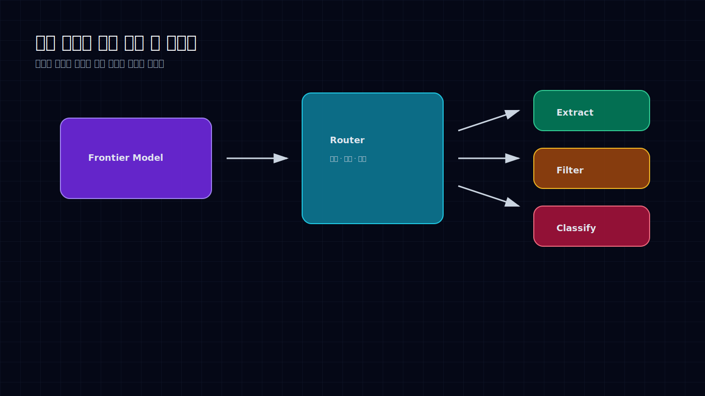
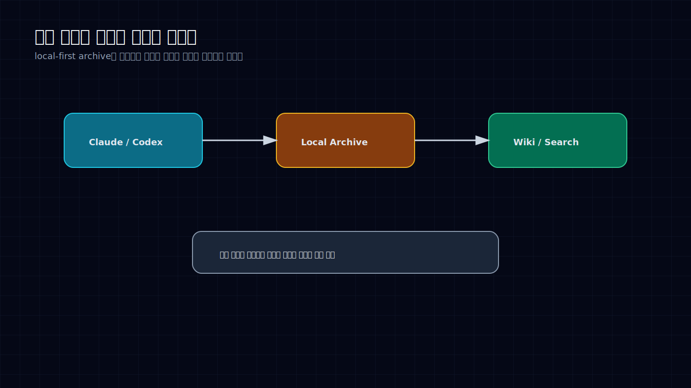
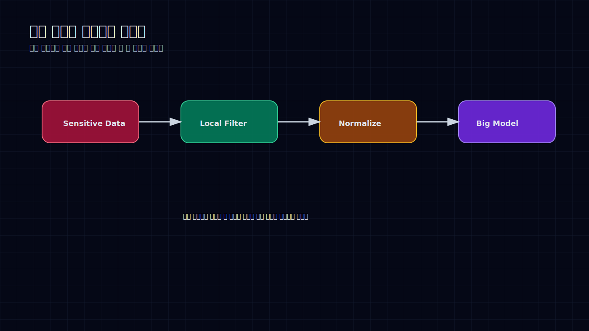

# 작은 모델은 비용 절감용이 아니라 제품 구조를 바꾸는 부품이다

작은 모델 이야기는 자주 “싸다”로 끝난다. 호출 비용이 낮고, 빠르고, 로컬에서도 돈다. 맞는 말이다.

그런데 그 정도로만 보면 아깝다. 작은 모델의 진짜 가치는 비용 절감보다 구조에 있다. 빠르고 가까운 모델이 있으면, 큰 모델에게 모든 일을 보내지 않아도 된다.

분류, 필터링, 정규화, extraction, 민감정보 제거, 세션 검색 같은 작업은 꼭 최고 성능 모델이 할 필요가 없다. 오히려 작은 모델이나 rule+LLM hybrid가 더 안정적일 때가 많다.

큰 모델은 판단과 계획에 쓰고, 작은 모델은 반복되는 앞단 작업에 쓴다. 이 조합이 제품 구조를 바꾼다.

## 로컬 세션은 버리는 대화가 아니다

Threadlens 같은 흐름이 흥미로운 이유는 단순 백업이 아니다. Codex, Claude, Gemini, Copilot 세션 로그를 local-first로 검색하고 정리한다는 점이다.

에이전트가 만든 대화와 작업 흔적은 생각보다 비싸다. 어떤 버그를 어떻게 찾았는지, 어떤 파일을 봤는지, 어떤 명령이 실패했는지, 어떤 결론을 냈는지가 들어 있다.

이걸 클라우드 채팅창 안에만 두면 다시 쓰기 어렵다. 로컬에 쌓고 검색할 수 있어야 다음 작업의 컨텍스트가 된다.

개인 지식 저장소를 local-first로 운영하려는 흐름도 같은 방향이다. 짧은 설정은 가벼운 memory에 두고, 긴 작업 맥락은 검색 가능한 로컬 지식 베이스에 남긴다. 이 구조가 없으면 에이전트는 매번 처음 보는 사람처럼 일한다.

## 로컬 모델은 민감 데이터 앞단에서 빛난다

BitNet, KV cache/벡터 압축, 온디바이스 LLM 흐름은 “클라우드 API 비용을 줄이자”는 이야기만은 아니다.

제품 관점에서는 데이터 경계를 다시 그릴 수 있다는 점이 중요하다. 민감한 원문을 바로 큰 모델로 보내지 않고, 로컬에서 필터링하거나 요약하거나 구조화한 뒤 보낼 수 있다. 네트워크가 느리거나 끊겨도 일부 기능은 계속 돈다. 반복적인 preprocessing은 가까운 곳에서 처리한다.

특히 업무 시스템에서는 이게 크다. 모든 문서, 모든 로그, 모든 고객 데이터를 외부 API로 보내는 구조는 비용도 문제지만 설명하기 어렵다. 로컬 전처리 레이어가 있으면 보낼 것과 남길 것을 나눌 수 있다.

## 실무 조직에서 작은 모델이 먼저 들어갈 자리

실무 조직에서는 작은 모델을 “저렴한 GPT 대체재”로 보면 안 된다. 역할을 좁게 잡아야 한다.

문서 분류, 개인정보/민감정보 필터링, 주소·상호명 정규화, 로그 라벨링, SQL 결과 설명 전처리, agent session 검색 같은 곳이 먼저다.

대형 LLM은 계획, 판단, 복잡한 설명에 쓴다. 작은 모델은 빠르고 반복적인 작업을 맡긴다. 그러면 비용이 줄어드는 것보다 더 중요한 효과가 생긴다. 시스템의 지연, 데이터 경계, 실패 범위를 통제할 수 있다.

작은 모델은 작아서 약한 게 아니다. 가까이 둘 수 있어서 쓸모가 있다. 모든 판단을 하나의 큰 모델에게 몰아주는 구조보다, 작고 빠른 부품들이 앞단을 정리해주는 구조가 더 오래 간다.

AI 제품의 다음 차이는 “누가 제일 큰 모델을 쓰는가”가 아니라 “어떤 일을 굳이 큰 모델에게 보내지 않는가”에서 날 가능성이 높다.

## Sources

- OpenAI mini/nano 계열 모델, BitNet, KV cache/벡터 압축, 온디바이스 LLM 관련 공개 자료
- Threadlens 등 local-first AI session archive 도구 흐름
- 이 글은 공개 자료와 필자의 리서치 메모를 바탕으로 재구성했다.
