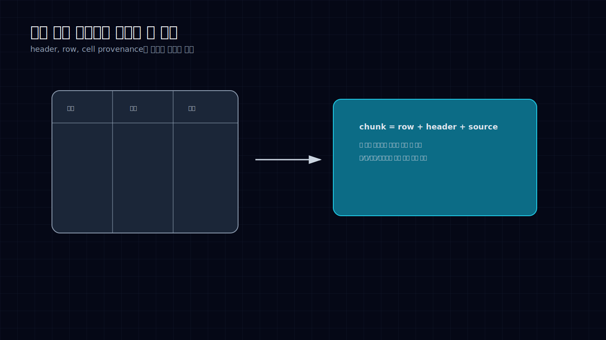
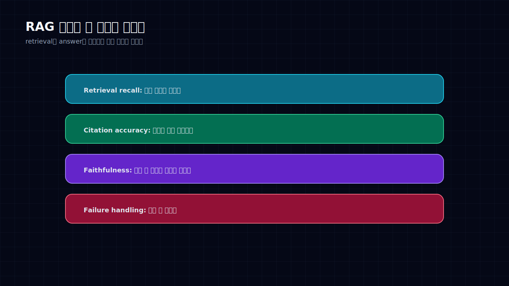

# RAG는 검색기가 아니라 문서 운영 파이프라인이다


RAG가 안 된다고 하면 보통 모델부터 바꾼다. 더 큰 모델, 더 긴 context, 더 좋은 embedding.

그런데 운영에서 RAG를 망치는 건 대개 앞단이다. PDF가 깨지고, 표가 풀리고, 제목 계층이 사라지고, 단위와 각주가 날아간다. 그 상태로 chunk를 만들면 검색은 이미 틀어진다. 마지막 답변 모델이 아무리 좋아도 잃어버린 구조를 복구하지 못한다.

RAG는 검색 기능이 아니다. 문서를 수집하고, 구조를 보존하고, 검색 단위를 만들고, 근거를 평가하고, 실패 사례를 다시 학습하는 운영 파이프라인이다.

## 문서 파싱은 전처리가 아니라 품질의 시작점이다



PDF, 표, 운영지침서, 금융/제조 문서처럼 구조가 복잡한 문서는 단순 텍스트 추출로 부족하다.

제목과 소제목의 계층, 표의 행과 열, 셀의 단위, 각주, 캡션, 페이지 끊김, 문서 버전과 날짜가 답변의 근거가 된다. 이 정보가 사라지면 검색 결과는 그럴듯하지만 틀린 조각이 된다.

특히 표는 조심해야 한다. 셀 값만 chunk로 떼어내면 값의 의미가 사라진다. “12.4”라는 값은 열 제목, 행 이름, 단위, 페이지, 주변 설명과 함께 있어야 답이 된다.

그래서 표 기반 RAG에서는 row 기반 chunk, section+table 병합 chunk, header 반복 주입, cell provenance 유지가 필요하다. 이건 세련된 옵션이 아니라 기본기다.

## RAG 평가는 한 점수로 끝나지 않는다



RAG 평가에서 “정답과 비슷한가”만 보면 위험하다. 운영에서 필요한 질문은 더 쪼개져 있다.

먼저 retrieval recall이다. 정답의 근거가 되는 문서를 실제로 찾았는가.

다음은 citation accuracy다. 인용한 근거가 답을 정말 뒷받침하는가. 문서는 찾았지만 다른 문단을 근거로 붙이는 경우가 흔하다.

그다음은 faithfulness다. 답변이 근거 밖 내용을 만들지 않았는가.

마지막으로 failure handling이다. 근거가 없을 때 모른다고 멈췄는가. 운영용 RAG에서는 이게 특히 중요하다. 모르면 모른다고 하는 시스템이, 그럴듯하게 지어내는 시스템보다 낫다.

이 평가를 분리해야 어디가 문제인지 보인다. retrieval이 틀렸는지, citation이 틀렸는지, answer generation이 과장했는지, freshness가 밀렸는지 알 수 있다.

## 실무 조직 문서 QA에 필요한 구조

실무 조직가 금융권 영업지원, PDF 자동 추출, 도메인 문서 QA를 운영한다면 RAG를 단순 검색기로 두면 안 된다.

필요한 구조는 이렇다.

```text
문서 수집
→ 구조 보존 파싱
→ 표/본문 단위 chunking
→ metadata + provenance 저장
→ retrieval eval
→ answer eval
→ 실패 사례 재학습
```

특히 agent와 결합하면 RAG는 tool memory가 된다. 에이전트가 판단할 때 참조하는 외부 기억이다. 그러면 출처와 평가 로그가 반드시 남아야 한다. “어디서 봤는지 모르지만 맞는 것 같다”는 답은 업무 시스템에 넣기 어렵다.

RAG의 품질은 마지막 답변의 문장력에서 결정되지 않는다. 문서가 들어오는 첫 순간부터 결정된다. 파싱이 깨지면 검색이 흔들리고, 검색이 흔들리면 답변은 꾸며진다.

그래서 RAG를 고치려면 모델 교체보다 먼저 문서의 형태를 지켜야 한다.

## Sources

- RAG chunking, document parsing, tabular data retrieval, RAG evaluation 관련 공개 자료와 강의 자료
- 문서 QA, PDF 파싱, retrieval recall, citation accuracy, answer faithfulness 관련 실무 메모
- 이 글은 공개 자료와 필자의 리서치 메모를 바탕으로 재구성했다.
